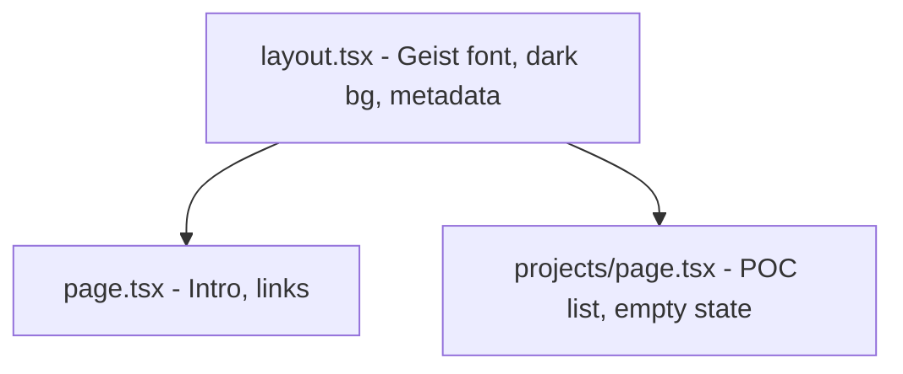

# Minimal Personal Website for Joachim Demuth

## Design Direction

- **Palette**: Near-black background (`#0a0a0a`), off-white text (`#e5e5e5`), a single mid-gray for secondary text (`#737373`). No accent colors. No gradients.
- **Typography**: Geist Sans (already loaded in layout). Restrained sizing -- large name heading, small body text, generous line height.
- **Layout**: Left-aligned, max-width container (~640px), plenty of whitespace. No hero images, no icons, no decorative elements.
- **Links**: Plain text with subtle underline or opacity change on hover. GitHub, X, LinkedIn, Email.
- **Tone**: Concise, direct. No "passionate about" or "welcome to my site" filler.

## Pages

### 1. Home (`/`)

A single, quiet page:

```
Joachim Demuth

Tech lead at P-Secure, Copenhagen.
Building things and experimenting with the
agentic side of AI.

Shooting film, discovering music.

GitHub  X  LinkedIn  Email
```

- Name as an `h1`, rest as short paragraphs
- Social links in a row at the bottom, plain text
- A small nav link to "/projects" (understated, maybe top-right or inline)

### 2. Projects (`/projects`)

- Same layout container
- Heading: "Projects"
- A short line like "Nothing here yet." or an empty state
- Structured so adding future POCs is trivial -- each project would be a simple card/row with a title, one-line description, and external link
- Nav link back to home

## File Changes

### [app/globals.css](app/globals.css)

- Strip the default Next.js theme variables
- Set dark background/foreground colors
- Add base styles: smooth font rendering, selection color, link styles
- Keep it minimal -- most styling via Tailwind utility classes

### [app/layout.tsx](app/layout.tsx)

- Update metadata (title: "Joachim Demuth", description)
- Clean up the body: dark bg, light text, centered max-width container
- Add a minimal shared nav (home + projects) or keep navigation per-page

### [app/page.tsx](app/page.tsx)

- Replace the entire default starter content
- Implement the home page as described above

### New: [app/projects/page.tsx](app/projects/page.tsx)

- Create the projects page with empty state
- Include a typed project list structure for easy future additions

### Cleanup

- Remove default SVGs from `public/` (next.svg, vercel.svg, file.svg, globe.svg, window.svg) -- they are unused
- Replace `public/favicon.ico` with a simple one or leave as-is

## Architecture




No external dependencies needed. Everything ships with what is already installed.